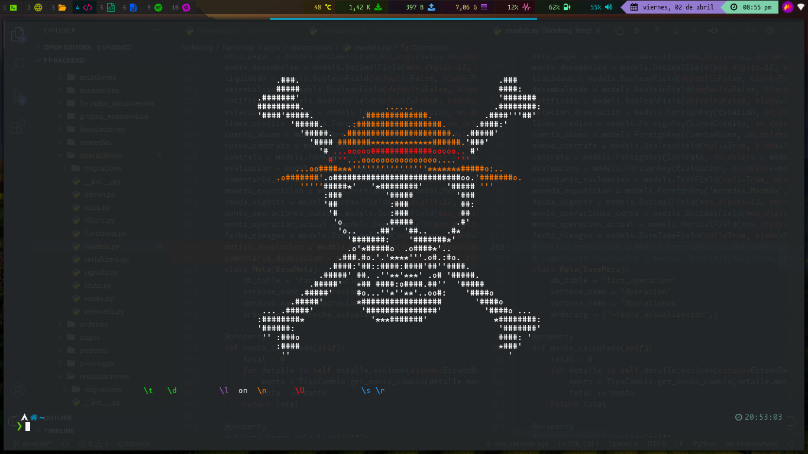

# i3

## Bar 

## Atajos de teclado

### Entorno

Atajo | Acción
-- | --
**mod + h** | Enforcar ventana de la izquierda
**mod + j** | Enforcar ventana de abajo
**mod + k** | Enforcar ventana de arriba
**mod + l** | Enforcar ventana de la derecha
**mod + u** | Enforcar ventana de urgencia
**mod + shift + h** | Mover ventana izquierda
**mod + shift + j** | Mover ventana abajo
**mod + shift + k** | Mover ventana arriba
**mod + shift + l** | Mover ventana derecha
**mod + alt + h** | Disminuir ancho ventana
**mod + alt + j** | Disminuir alto ventana
**mod + alt + k** | Aumentar alto ventana
**mod + alt + l** | Aumentar ancho ventana

Atajo | Acción
-- | --
**mod + ctrl + $\rightarrow$** | División horizontal
**mod + ctrl + $\downarrow$** | División vertical
**mod + f** | Alternar modo pantalla completa
**mod + shift + f** | Alternar modo pantalla completa global
**mod + t** | Alternar diseño del contenedor `splith,splitv, tabbed`
**mod + z** | Alternar modo de ventana `tiling, floating`
**alt + tab** | Alternar foco entre ventanas `tiling` y `floating`
**mod + tab** | Enfocar ventana siguiente
**mod + shift + tab** | Enfocar ventana anterior
**mod + p** | Enfocar contenedor padre
**mod + o** | Enfocar contenedor hijo
**mod + -** | Mostrar `scratchpad`
**mod + shift + -** | Mover ventana hacia `scratchpad`
**mod + y** | Alternar modo de ventana `sticky`
**mod + shift + y** | Cambiar modo de ventana `sticky` en la esquina inferior derecha de la pantalla

Atajo | Acción
-- | --
**mod + $\rightarrow$** | Enfocar siguiente *workspace*
**mod + $\leftarrow$** | Enfocar anterior *workspace*
**mod + Esc** | Enfocar último *workspace* enfocado

Atajo | Acción
-- | --
**mod + g** | Alternar *gaps*
**mod + shift + r** | Mostrar opciones de reiniciar configuración y salir
