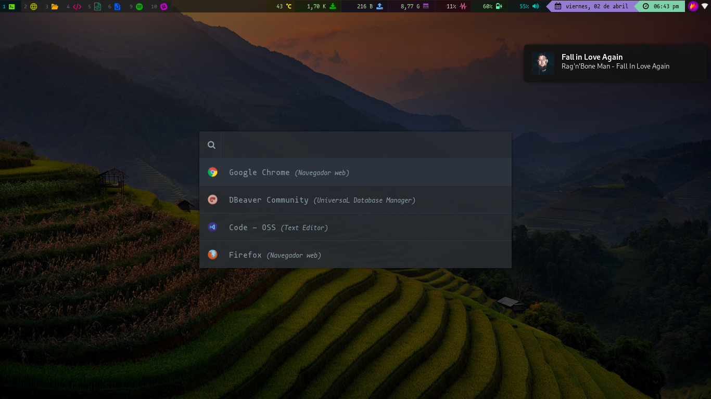
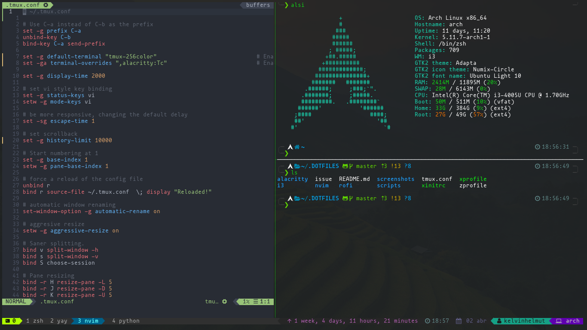
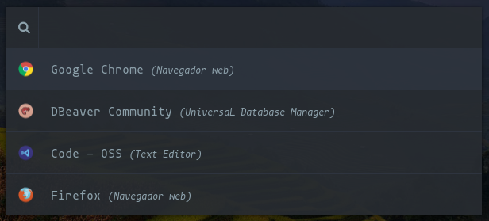
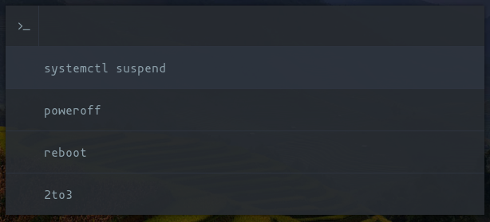

# DOTFILES



Copiar las configuraciones en sus respectivas ubicaciones en `$HOME`, o ejecutar `setup.sh` para
hacerlo de manera automática, generando backup de las configuraciones existentes y creando enlaces
a las nuevas configuraciones, si no quiere hacer backup ejecutar `setup.sh --nobackup`

## Window manager

### i3


[Ver más](./.config/i3/)

#### X11

##### ~/.xinitrc

Configuraciones cuando se inicia con `startx`. [Ver](./.xinitrc)

##### ~/.xprofile

Configuraciones de inicio generales. [Ver](./.xprofile)

##### $WM/autostart

Configuraciones de inicio especificos para `$WM (i3 | qtile | awesome | otro)`. [Ver](./.config/i3/autostart)

##### ~/.zprofile

Configuración para el inicio automático del gestor de ventanas al iniciar sesión. [Ver](./.zprofile)
> Si usa bash cambiar el nombre a ~/.bash_profile

#### Scripts

Se encuentran en `~/.local/bin` [Ver](./local/bin)

##### volume
`$ volume [up|down|toggle]`

##### brightness
`$ brightness [up|down|full|off]`

##### chromecast_wallpaper.py ([Gist](https://gist.github.com/KelvinHelmut/1f0413337ad91620e3e7ba1e4553ca5d))
`$ chromecast_wallpaper.py [start|prev|next|stop|standalone]`


## Terminal



##### Tmux
```
$ pacman -S tmux
```

##### Alacritty
```
$ pacman -S alacritty
```

##### Zsh
```
$ pacman -S zsh
```
- [Oh my zsh](https://github.com/ohmyzsh/ohmyzsh)
- [Powerlevel 10k](https://github.com/romkatv/powerlevel10k)
- [zsh-syntax-highlighting](https://github.com/zsh-users/zsh-syntax-highlighting)
- [zsh-syntax-highlighting](https://github.com/zsh-users/zsh-syntax-highlighting)

---

## Aplicaciones

#### Rofi (launcher)




```bash
$ yay -S rofi
$ yay -S rofi-calc # Optional for calc
```

Nombre | Tipo | Instalar
-- | -- | --
yay | gestor de paquetes | [Github](https://github.com/Jguer/yay)
nm-applet | net | `$ pacman -S nm-applet`
picom | compositor | `$ pacman -S picom`
redshift | screen | `$ pacman -S redshift`
hsetroot | set wallpaper | `$ pacman -S hsetroot`
xbacklight | brightness | `$ pacman -S xorg-xbacklight`
amixer | audio (ALSA) | `$ pacman -S alsa-utils`
xclip | clipboard | `$ pacman -S xclip`
[chromecast_wallpaper](https://gist.github.com/KelvinHelmut/1f0413337ad91620e3e7ba1e4553ca5d) | wallpaper | [Gist](https://gist.github.com/KelvinHelmut/1f0413337ad91620e3e7ba1e4553ca5d)
flameshot | screenshot | `$ pacman -S flameshot`

### Nvim


[Ver más](./nvim/README.md)

### Fonts

- [Powerline](https://github.com/powerline/fonts)

```
$ yay -S powerline-fonts-git
```

- [Nerd fonts](https://github.com/ryanoasis/nerd-fonts)

```bash
# Download font and extract, example mononoki
$ sudo cp -r Downloads/mononoki /usr/share/fonts/
$ fc-cache # optional
```
